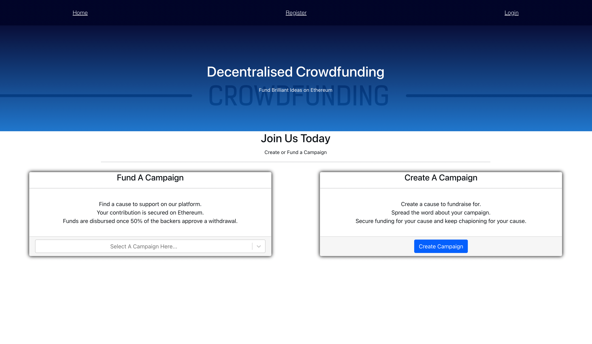

# A MERN crowdfunding app that works with Ethereum

## This application allows users to register an account, create a cause/campaign to donate to and lets other users donate to the cause.

### It is build on the MERN stack and the homepage UI looks like this👇🏾

## **Project Structure**
## The app folder is where most of the server stuff is located and it contains these folders:
1. Config - has the various project configurations (db etc...)
2. Controllers - control the various actions that happen to the DB
3. Middleware - intermediary functions for auth etc..
4. Models - Schema for various collections
5. Routes - Which route to call to do which action
> To run the server just run `npm run start` in the root of the project.

## The client folder is where the frontend is located
> To run the client just run `npm run start` in the client folder of the project.

#### All data is stored in Mongo DB apart from the Ethereum part which utilises web3 to transfer and withdraw ether.

# Feel free to clone and enjoy ✌🏾